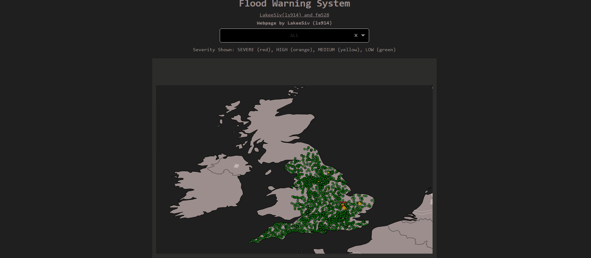

<details open="open">
  <summary>Table of Contents</summary>
  <ol>
    <li><a href="#About">About</a></li>
    <li><a href="#Webapp">Webapp</a></li>
    <li><a href="#Installation">Installation</a></li>
    <li>
      <a href="#Tasks">Tasks</a>
      <ul>
        <li><a href="#Milestone-1">Milestone 1</a></li>
        <li><a href="#Milestone-2">Milestone 2</a></li>
      </ul>
    </li>
    <li><a href="#Documentation">Documentation</a></li>
  
  </ol>
</details>


# About

This is the Part IA Lent Term computing activity at the Department of
Engineering, University of Cambridge done by

<li>Lakee Sivaraya (ls914)</li>
<li>Frank McMullan (fm528)</li>

The activty involves using real-time river level data at nearly 000 monitoring stations that is made available by the Department for Environment Food and Rural Affairs (DEFRA) at [https://environment.data.gov.uk/](https://environment.data.gov.uk/)

As a team we had to complete the [tasks](#Tasks) at [https://cued-partia-flood-warning.readthedocs.io/en/latest/deliverables.html](https://cued-partia-flood-warning.readthedocs.io/en/latest/deliverables.html)

# Webapp

<p align="center">

</p>

A Web interface was created using [Dash](https://plotly.com/dash/), the benefit of using this module was that it allowed me to use the python functions directly, insted of saving all the station data to a JSON file and then accessing the data using Javascript. In addition since Dash was created by [plotly](https://plotly.com/), it allowed me to use easily display my plotly geoscatter graph on a website easily.

The role of this webpage is to use real time data to predict if an area is at risk of flooding

You can view a live version of this app at:
[https://flood-lsfm.herokuapp.com/](https://flood-lsfm.herokuapp.com/)

>Note: Sometimes when opening the website, you run into an application error, this is beacuse I used Heroku to host my webapp, and Heroku is notorius for being quite slow. Additionally we are fetching data from over 2000 stations, so it can crash. If it does crash, wait a few minutes and go back onto the website, in most cases it should work again - Lakee

# Installation
This section covers how to run the webapp locally.
1. Clone the repo

    ```bash
    git clone https://github.com/cued-ia-computing/flood-fm528-ls914.git
    ```
2. Install the requirements

    ```bash
     pip install -r requirements.txt
    ```
3. Run `app_G.py1`

    ```python
    python app_G

    ```
    You should get an output in the terminal that should look something like
    ```
    Dash is running on http://127.0.0.1:8050/

    * Serving Flask app "app_G" (lazy loading)
    * Environment: production
    WARNING: This is a development server. Do not use it in a production deployment.
    Use a production WSGI server instead.
    * Debug mode: on
    ```
    
    Open the link on the first line to view the website locally
# Tasks

## Milestone 1

- [x] 1A - <i>(already completed in the template)</i>
- [x] 1B - completed by Lakee 
- [x] 1C - completed by Lakee 
- [x] 1D - completed by Frank
- [x] 1E - completed by Frank
- [x] 1F - completed by Lakee

## Milestone 2 

- [x] 2A - <i>(already completed in the template)</i>
- [x] 2B - completed by Lakee
- [x] 2C - completed by Frank
- [x] 2D - <i>(already completed in the template)</i>
- [x] 2E - completed by Frank
- [x] 2F - completed by Lakee
- [x] 2G - completed by Frank ([Analysis (sort_by_risk)](./floodsystem/analysis.py)) and Lakee ([Webapp](app_G.py))


# Documentation

The activity is documented at
https://cued-partia-flood-warning.readthedocs.io/. 